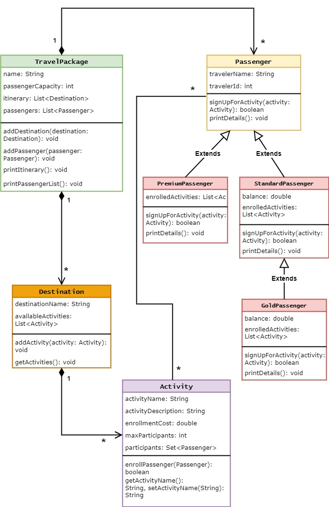
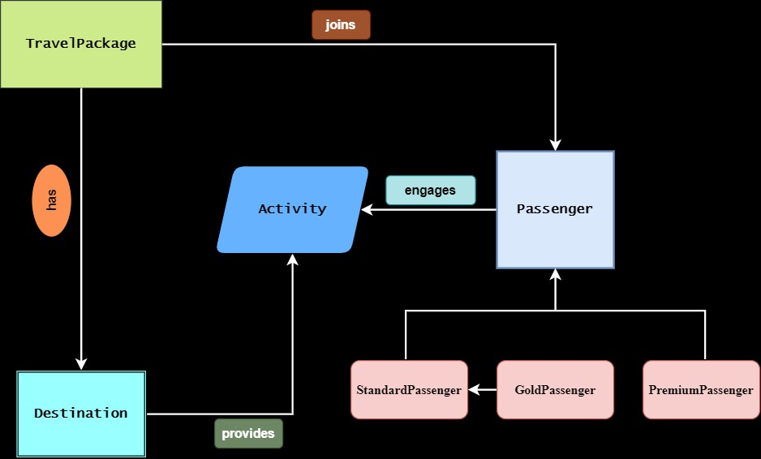

# Travel Package System

## Introduction
The Travel Package System is a sophisticated Java application designed for travel agencies to manage various travel packages. This system allows agencies to create packages with multiple destinations and activities, and to manage customer enrollments with ease.

## Features
- Manage multiple travel packages with unique itineraries
- Support various destination and activity inclusions
- Enroll passengers with different membership tiers (Standard, Gold, Premium)
- Print detailed itineraries and passenger lists
- Monitor activity capacities and passenger enrollments

## System Specifications
The system is built with the following specifications:

1. Travel packages each with a unique name, passenger capacity, and an itinerary.
2. Destinations have a name and host a list of available activities.
3. Activities come with details like name, description, cost, and capacity.
4. Passengers can sign up for any number of activities given capacity limits.
5. Passenger types include standard, gold, or premium, each with different benefits.

## Sub-Tasks for Implementation
- **Higher Level Diagram**: Develop a high-level block diagram showcasing system interactions.
- **Lower Level Diagram**: Create a detailed UML class diagram for all necessary classes.
- **Implementation**: Code the system using Java according to the given specifications.
- **Unit Testing**: Write comprehensive unit tests for each class using JUnit.

## Low-Level UML Diagram
The Low-Level UML Diagram outlines the class structure and relationships within the system.



## High-Level Design
The High-Level Design diagram provides a broader view of the system's architecture, highlighting the interactions between the TravelPackage, Destination, Activity, and Passenger components.



## Getting Started

### Prerequisites
- JDK 21 
- IntelliJ IDEA or another Java IDE
- Git

### Installation
Clone the repository and open it in your preferred Java IDE.
```bash
git clone https://github.com/AmanDwi730/Task_TravelPackage.git
